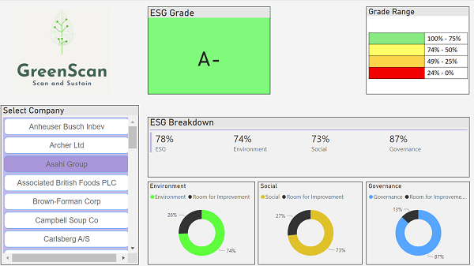
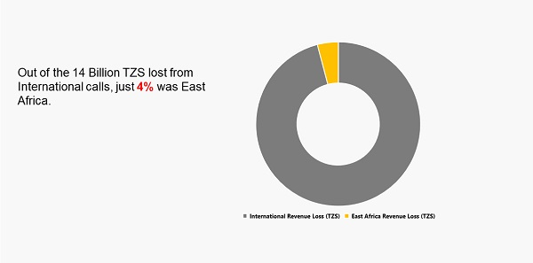

Some of the insights i have worked on have ended up as blog posts and stand alone articles. Below are a highlight of some of them. Topics are broad as i have an interest in different topics. 
  
If there is a topic you are looking to gain insights on or collaborate on, feel free to reach out `r emo::ji("v")`.

<h3 align="center">
Conscious consumers: The future
</h3>
   

As Environmental, Social and Governance (ESG) criteria begin to influence, in an increasing amount, investment decisions, how can millennials exploit the same ESG information to help them make more value-based purchasing decisions of consumer goods? Read more `r emo::ji("point_down")`

  

<h3 align="center">
Digital regulations: A danger
</h3>

Efforts to increase digital regulations in **Tanzania** will negatively impact around 48% of the population who accessed roughly 93 Billion megabytes of internet data in the last quarter of 2020. Currently, just 1 in 4 people have access to internet services in Sub-Saharan Africa, the lowest of any region in the world. Read more `r emo::ji("point_down")`

  

<h3 align="center">
Perceptions: Reality Skewed
</h3>

If there is one thing this pandemic has laid bare is just how strong public perceptions are often misconstrued as reality. During the pandemic, policymakers, scientists, and news agencies have been trying to shape, change, and influence myriad public perceptions.
Public perception can be strong, but is it rooted in reality? Do echo chambers end up perpetuating beliefs, even in the face of facts to the contrary?
Read more `r emo::ji("point_down")`

  
